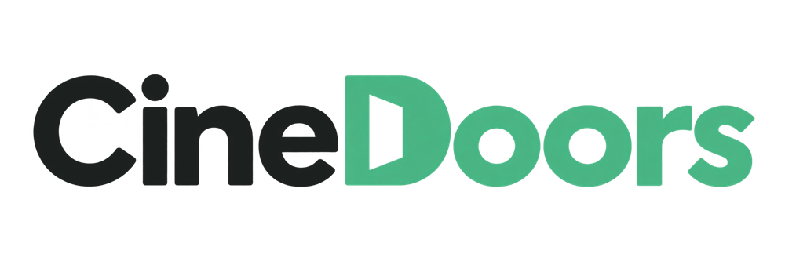
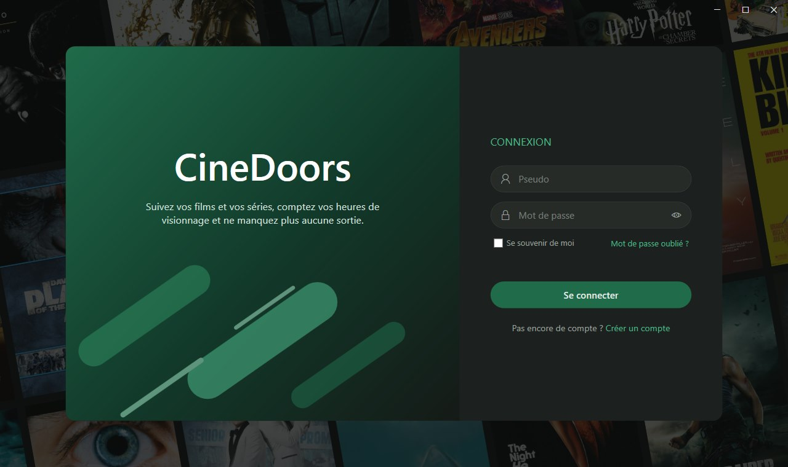
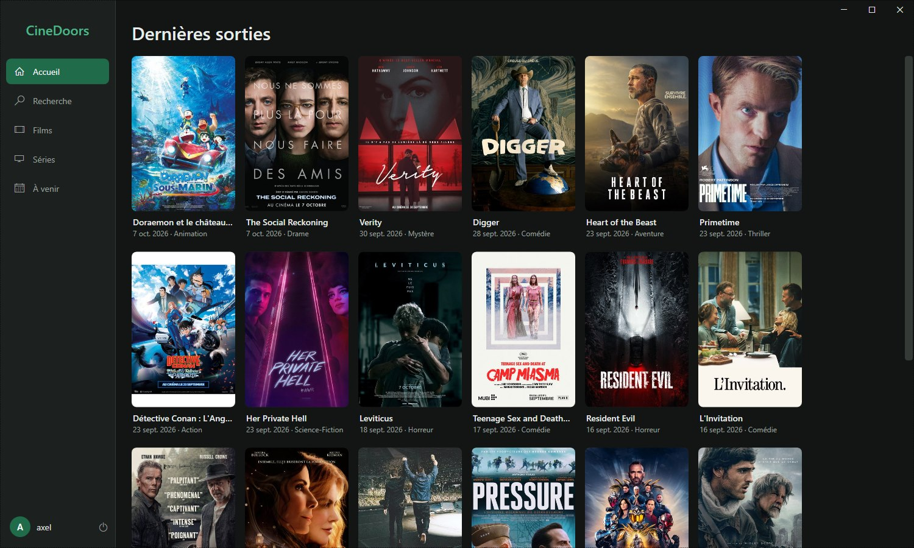

<!-- Logo : la version aux lettres claires s'affiche en thème sombre, l'autre en thème clair -->
<p align="center">
  <picture>
    <source media="(prefers-color-scheme: dark)" srcset="screenshots/logo-theme-sombre.png">
    
  </picture>
</p>

---

Application de bureau Windows pour suivre ses films et ses séries, à la manière de TV Time : un compte, des listes « à voir » et « vus », le temps passé devant l'écran et les sorties à venir.

Projet personnel réalisé pour apprendre le C#, l'écosystème .NET et Visual Studio, avec une base de données PostgreSQL sous Docker.





## Fonctionnalités

Disponibles :

- Création de compte et connexion, avec mots de passe hachés (PBKDF2, sel par compte).
- Accueil avec les dernières sorties de films, chargées depuis l'API TMDB.
- Interface sombre qui s'adapte à la taille de la fenêtre, barre de titre intégrée.
- Navigation entre les écrans.

En cours de développement :

- Listes de films « à voir » et « vus », compteurs de temps de visionnage.
- Recherche dans le catalogue.
- Séries : suivi par épisode, par saison ou en entier.
- Sorties à venir et notifications.
- Réinitialisation du mot de passe par e-mail. La fenêtre actuelle réinitialise sans vérification et ne sert qu'aux tests.

## Stack

| Élément | Choix |
|---|---|
| Langage et plateforme | C# sur .NET 10 |
| Interface | WPF |
| Base de données | PostgreSQL 17, dans Docker |
| Accès aux données | EF Core (ORM) avec le pilote Npgsql pour PostgreSQL, migrations versionnées |
| Catalogue | API REST de TMDB |
| Tests | xUnit |

## Organisation du code

La solution est découpée en quatre projets, pour séparer les règles métier, la technique et l'interface :

| Projet | Rôle |
|---|---|
| `CineDoors.Core` | Entités métier. Ne dépend d'aucun autre projet. |
| `CineDoors.Infrastructure` | Accès à PostgreSQL (EF Core), client TMDB, hachage des mots de passe, service de compte. |
| `CineDoors.App` | Application WPF : fenêtre, écrans, thème. |
| `CineDoors.Tests` | Tests unitaires et tests d'intégration sur PostgreSQL. |

## Lancer le projet

Prérequis : Windows, le SDK .NET 10, Docker Desktop et un compte TMDB (gratuit) pour obtenir un jeton d'accès à l'API.

1. Démarrer la base de données. Copier `.env.example` en `.env`, y renseigner un mot de passe, puis :

```bash
docker compose up -d
```

2. Définir les deux variables d'environnement lues par l'application, puis rouvrir le terminal :

```bash
setx CINEDOORS_DB "Host=localhost;Port=5432;Database=cinedoors;Username=cinedoors;Password=<mot de passe du fichier .env>"
```

```bash
setx CINEDOORS_TMDB_TOKEN "<jeton d'accès en lecture à l'API TMDB>"
```

3. Créer les tables :

```bash
dotnet tool install --global dotnet-ef
```

```bash
dotnet ef database update -p src/CineDoors.Infrastructure -s src/CineDoors.Infrastructure
```

4. Lancer l'application :

```bash
dotnet run --project src/CineDoors.App
```

Aucun secret n'est stocké dans le dépôt : le mot de passe de la base et le jeton TMDB restent dans des variables d'environnement.

## Tests

```bash
dotnet test
```

Les tests d'intégration utilisent la base PostgreSQL : Docker doit être démarré et `CINEDOORS_DB` définie.

---

Ce produit utilise l'API TMDB mais n'est ni approuvé ni certifié par TMDB. Les affiches visibles sur les captures d'écran appartiennent à leurs ayants droit.
